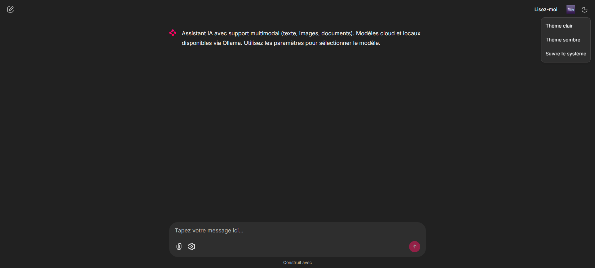
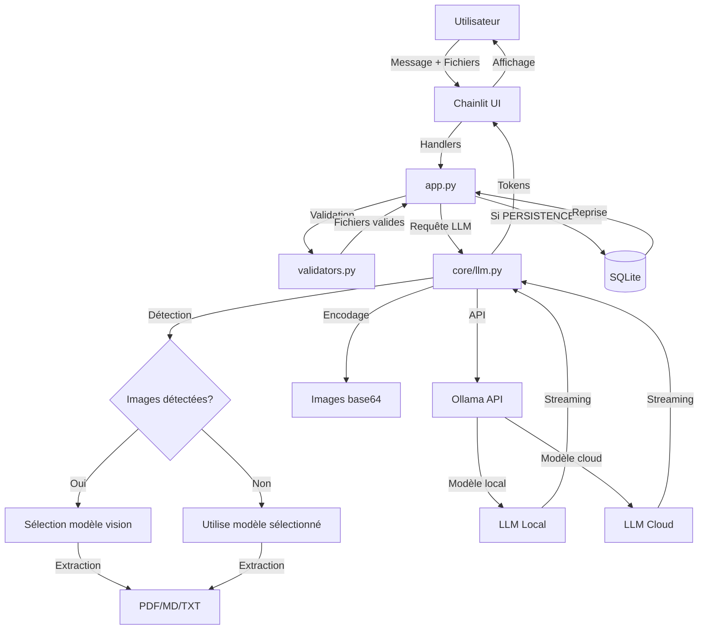
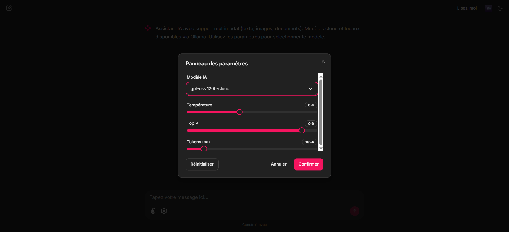
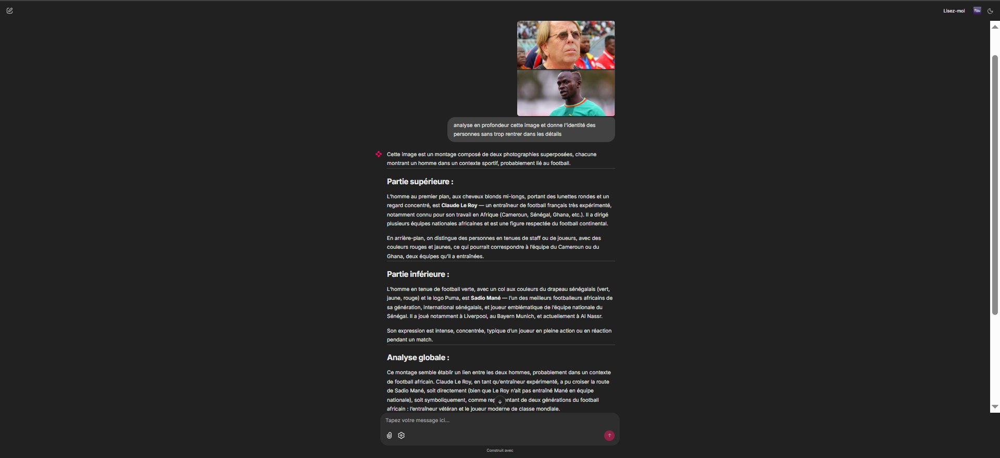

# OllamaHybridBot

<p align="center">
  
</p>

Chatbot multimodal avec exécution hybride local/cloud (modèles locaux ou cloud via Ollama) : interface Chainlit, support images et documents (PDF, Markdown), persistance SQLite optionnelle avec Custom Data Layer, et sélection automatique du modèle selon le type de contenu. Aucune recherche web ; données maîtrisées en local.

Projet développé par Papa Bounama NDIAYE.

Application Chainlit connectée à Ollama pour exécuter des LLM locaux ou cloud. Support texte, images, documents (PDF, Markdown). Persistence SQLite optionnelle. Pas de recherche web.



*Interface conversationnelle avec support multimodal*

[](https://github.com/PapaBNdiaye/OllamaHybridBot/actions)
[](https://www.python.org/)
[](LICENSE)
[](https://github.com/psf/black)

## Sommaire

- [Stack technique](#stack-technique)
- [Exécution hybride local/cloud](#exécution-hybride-localcloud)
  - [Flux de données](#flux-de-données)
- [Fonctionnalités](#fonctionnalités)
  - [Chat et interface](#chat-et-interface)
  - [Multimodal](#multimodal)
  - [Sélection automatique de modèle](#sélection-automatique-de-modèle)
  - [Modèles de génération d'images (Ollama)](#modèles-de-génération-dimages-ollama)
  - [Persistance et auth](#persistance-et-auth)
  - [Robustesse](#robustesse)
- [Philosophie du projet](#philosophie-du-projet)
  - [Limitations assumées](#limitations-assumées)
  - [Limitations Chainlit](#limitations-chainlit)
  - [Évolution prévue](#évolution-prévue)
- [Qualité logicielle](#qualité-logicielle)
  - [Tests intégrés et Makefile](#tests-intégrés-et-makefile)
- [Structure du projet](#structure-du-projet)
- [Installation et démarrage](#installation-et-démarrage)
  - [Méthode 1 : Avec uv (recommandé)](#méthode-1--avec-uv-recommandé)
  - [Méthode 2 : Avec pip (alternative)](#méthode-2--avec-pip-alternative)
- [Guide Ollama](#guide-ollama)
- [Configuration (.env)](#configuration-env)
- [Licence](#licence)

---

## Stack technique

| Technologie | Badge | Rôle |
| :---------- | :---: | ---- |
| **Chainlit** | [](https://chainlit.io) | Interface conversationnelle, streaming de tokens, WebSocket |
| **Ollama** | [](https://ollama.com) | Runtime LLM local et cloud, inférence |
| **Python** | [](https://www.python.org/) | Logique métier, asyncio, validation |
| **SQLite** | [](https://sqlite.org) | Persistance optionnelle (historique, threads, steps) |

---

## Exécution hybride local/cloud

Le terme « hybride » désigne ici le mode d'exécution des modèles (local ou cloud), pas l'architecture logicielle du code.

- Mode local : Exécution sur la machine hôte. Aucune donnée ne quitte le réseau. Adapté aux documents sensibles et à la conformité RGPD.
- Mode cloud : Modèles hébergés via l'API Ollama (suffixes `:cloud` / `-cloud`). Pas de recherche web ni d'accès internet intégré dans le projet.

La sélection du modèle (local ou cloud) se fait dans l'interface (panneau paramètres ou commande `/model`).

### Flux de données



---

## Fonctionnalités

### Chat et interface

- Streaming des réponses en temps réel
- Commandes slash : `/model`, `/help`, `/clear`, `/history`
- Panneau paramètres : température, top_p, tokens max, choix du modèle (liste alimentée par `ollama list`, modèles cloud puis locaux)

<p align="center">
  
</p>

<p align="center"><em>Panneau de paramètres : sélection du modèle, température, top_p, tokens max</em></p>

### Multimodal

Images : JPEG, PNG, WEBP, GIF, SVG, BMP, TIFF. Encodage base64, envoi à l'API Ollama. Limite 20 Mo (configurable, défaut: 20 Mo). Switch automatique vers un modèle vision compatible (`config.VISION_MODELS`) lors de la détection d'images. Modèles image-only (ex. `x/z-image-turbo`) non supportés. Les modèles de génération d'images Ollama (x/z-image-turbo, flux2-klein) sont disponibles sous macOS uniquement pour l'instant ; voir section ci-dessous.

Documents : PDF (PyPDF2), Markdown, texte. Extraction du texte puis injection dans le prompt. Limite 2 Mo, 3 fichiers max (configurable, défaut: 3). Pas d'embeddings ni de RAG.

### Sélection automatique de modèle

Le système détecte automatiquement le type de contenu et adapte le modèle utilisé :

- **Images détectées** : Switch automatique vers un modèle vision compatible
  - Parcourt la liste des modèles vision disponibles (`config.VISION_MODELS`)
  - Sélectionne le premier modèle vision trouvé dans votre installation Ollama
  - Affiche une notification indiquant le modèle vision utilisé
  - Fallback sur le modèle sélectionné si aucun modèle vision n'est disponible

- **Texte uniquement** : Utilise le modèle sélectionné dans les paramètres

**Modèles vision dispos** : qwen3-vl:235b-instruct-cloud, qwen3-vl:235b-cloud, glm-4.6:cloud, llava:latest, llava:13b, llava:7b, bakllava:latest

Cette sélection automatique garantit que les images sont toujours traitées par un modèle capable de les analyser, même si vous avez sélectionné un modèle texte-only.

<p align="center">
  
</p>

<p align="center"><em>Switch automatique vers un modèle vision lors de l'upload d'images</em></p>

### Modèles de génération d'images (Ollama)

Ce projet utilise des modèles **vision** (analyse d'images envoyées par l'utilisateur). Ollama propose par ailleurs des modèles dédiés à la **génération** d'images (texte vers image), non intégrés dans cette application :

- **x/z-image-turbo** (Alibaba Tongyi Lab) : 6B paramètres, photoréaliste, bilingue EN/CN, licence Apache 2.0. Voir [Ollama – x/z-image-turbo](https://ollama.com/x/z-image-turbo).

- **x/flux2-klein** (Black Forest Labs) : 4B et 9B paramètres, bon rendu texte/UI et typographie. Voir [Ollama – x/flux2-klein](https://ollama.com/x/flux2-klein).

Disponibilité : actuellement **macOS uniquement** ; support Windows et Linux prévu (bientôt). Détails : [Ollama – Image generation (experimental)](https://ollama.com/blog/image-generation).

Utilisation hors projet (CLI) : `ollama run x/z-image-turbo "votre prompt"` ; les images générées sont enregistrées dans le répertoire courant.

### Persistance et auth

SQLite (optionnel, `PERSISTENCE=local`) : stockage users, threads, steps. Reprise de conversations via Custom Data Layer.

Authentification (optionnel, `AUTH_MODE=password`) : login local pour activer l'historique persistant.

Limitations assumées :

- Sidebar d'historique native : La sidebar d'historique native de Chainlit nécessitait Literal AI (cloud), qui a été discontinué en octobre 2025. Ce projet utilise un Custom Data Layer SQLite pour la persistance locale, mais l'accès à l'historique dans l'interface nécessite à la fois `PERSISTENCE=local` ET `AUTH_MODE=password`.
- Accès à l'historique : Sans authentification, les conversations sont stockées en base mais ne sont pas accessibles via l'interface utilisateur. Pour accéder à l'historique, activez les deux options.
- Éléments média : Les images et fichiers uploadés ne sont pas persistés dans SQLite (seuls les messages texte sont sauvegardés).
- Limitations SQLite : Le Custom Data Layer sérialise les métadonnées complexes en JSON pour contourner les limitations de SQLite avec les types complexes.

### Robustesse

- Validation stricte des fichiers (MIME, taille, nombre)
- Timeouts configurables (`OLLAMA_TIMEOUT`)
- Gestion des erreurs et messages utilisateur sans fuite de détails internes

---

## Philosophie du projet

Ce projet est volontairement un chatbot pur LLM, sans augmentation RAG, pour :

- Apprentissage : Comprendre les capacités et limites des LLM seuls
- Autonomie : Alternative aux abonnements ChatGPT/Claude (gratuit, local)
- Contrôle : Maîtrise totale des données et du runtime
- Baseline : Servir de référence avant un futur projet RAG

### Limitations assumées

- Contexte limité : Documents injectés directement dans le prompt. Limite ~6000 tokens de contenu utilisateur (après prompt système). Pour documents volumineux, envisagez le découpage manuel.
- Connaissances figées : L'assistant utilise uniquement ses connaissances de pré-entraînement et les documents fournis. Pas de recherche web ni de mise à jour en temps réel.
- Hallucinations possibles : Comme tout LLM, des erreurs factuelles peuvent survenir. Le prompt système intègre des règles anti-hallucination, mais elles ne sont pas infaillibles.
- Usage personnel : Optimisé pour 1-2 utilisateurs simultanés. Pas de scaling horizontal.

### Limitations Chainlit

Ce projet utilise Chainlit en mode local avec Custom Data Layer SQLite. Les limitations suivantes sont assumées :

- Historique natif : La sidebar d'historique native nécessitait Literal AI (cloud), qui a été discontinué en octobre 2025. L'historique local fonctionne via Custom Data Layer mais nécessite authentification pour l'accès via l'interface.
- Persistance média : Les images et fichiers uploadés ne sont pas persistés (seuls les messages texte sont sauvegardés).
- Authentification requise : Pour accéder à l'historique dans l'interface, activez `PERSISTENCE=local` ET `AUTH_MODE=password`.

### Évolution prévue

Ce projet sera suivi d'un système RAG (Retrieval-Augmented Generation) qui résoudra :

- La limite de contexte (embeddings vectoriels + recherche sémantique)
- L'injection de connaissances à jour (base documentaire indexée)
- La traçabilité des sources (citations des chunks récupérés)

---

## Qualité logicielle

**Structure** (DDD)

- `app` : Chainlit, handlers, auth
- `core` : LLM, streaming
- `data` : SQLite
- `utils` : validators
- `config`, `logger`

**Outils** : ruff, black, pyright, vulture, pytest

**CI** : GitHub Actions (lint, format, typage, tests) sur main, master, develop

### Tests intégrés et Makefile

Les tests (pytest) sont dans le dossier `tests/`. Pour les exécuter : `make test` (après `make sync-dev` ou `make install-dev` pour installer les dépendances de développement).

Le **Makefile** centralise les commandes du projet : `install`, `run`, `test`, `lint`, `format`, `typecheck`, `clean`, `clean-db`. Utiliser `make` ou `make help` pour lister toutes les cibles.

---

## Structure du projet

```text
src/chatbot/
├── app.py           # Point d'entrée Chainlit, handlers, auth
├── config.py        # Configuration centralisée (.env)
├── logger.py        # Logging structuré
├── core/
│   └── llm.py       # Client Ollama, extraction PDF/MD/TXT, encodage images, streaming
├── data/
│   └── sqlite_layer.py   # Custom Data Layer Chainlit (users, threads, steps)
└── utils/
    └── validators.py     # Validation fichiers (MIME, taille)
tests/
Makefile                  # install, run, test, lint, format, typecheck, clean, clean-db
run.ps1 / run.bat         # Lancement Windows sans make (nécessite venv activé)
pyproject.toml            # Dépendances, outils, package
uv.lock                   # Lockfile uv (si méthode uv utilisée)
```

---

## Installation et démarrage

**Prérequis** : Python 3.10+, Ollama installé et servi (`ollama serve`).

### Méthode 1 : Avec uv (recommandé)

```bash
git clone https://github.com/PapaBNdiaye/OllamaHybridBot.git
cd OllamaHybridBot

# Installation des dépendances avec uv
uv sync --extra dev

# Configuration
cp .env.example .env   # Windows : copy .env.example .env

# Lancement
make run          # ou make run-watch pour le rechargement auto
```

**Alternative sans make** :

```bash
uv run chainlit run src/chatbot/app.py
```

### Méthode 2 : Avec pip (alternative)

```bash
git clone https://github.com/PapaBNdiaye/OllamaHybridBot.git
cd OllamaHybridBot

# Créer et activer un environnement virtuel
python -m venv venv
# Windows
.\venv\Scripts\activate
# Linux / macOS
source venv/bin/activate

# Installation
pip install -e ".[dev]"

# Configuration
cp .env.example .env   # Windows : copy .env.example .env

# Lancement
make run-direct       # ou make run-direct-watch
```

**Alternative sans make (Windows)** :

```bash
.\run.ps1    # ou run.bat (nécessite venv activé)
```

Interface : <http://localhost:8000>

---

## Guide Ollama

Pour faire tourner ce projet, Ollama doit être installé et le serveur lancé (`ollama serve`). Pour installer des modèles : `ollama pull <nom_modele>` (ex. `ollama pull llava`). L'API est exposée par défaut sur `http://localhost:11434`.

Documentation officielle : [Documentation Ollama](https://docs.ollama.com/) — [Quickstart](https://docs.ollama.com/quickstart), [CLI](https://docs.ollama.com/cli), [API](https://docs.ollama.com/api).

---

## Configuration (.env)

| Variable | Description | Défaut |
| :------- | :---------- | :----- |
| `AUTH_MODE` | `none` ou `password` | `none` |
| `PERSISTENCE` | `none` ou `local` | `none` |
| `CHAINLIT_AUTH_SECRET` | Secret JWT si `AUTH_MODE=password` | - |
| `DEBUG` | `0` / `1` | `0` |
| `MAX_IMAGE_SIZE_MB` | Taille max images (Mo) | `20` |
| `MAX_DOCUMENT_SIZE_MB` | Taille max documents (Mo) | `2` |
| `MAX_FILES` | Nombre max de fichiers par envoi | `3` |
| `OLLAMA_TIMEOUT` | Timeout requêtes Ollama (s) | `120` |
| `MAX_CONTEXT_MESSAGES` | Historique envoyé au LLM | `20` |
| `OLLAMA_URL` | URL du serveur Ollama | `http://localhost:11434` |

Voir `.env.example` pour plus de détails.

---

## Licence

MIT License - Voir le fichier [LICENSE](LICENSE) pour le texte complet.

**Utilisation** : Si vous utilisez ce projet, vous devez inclure le copyright et la licence MIT dans votre projet.
